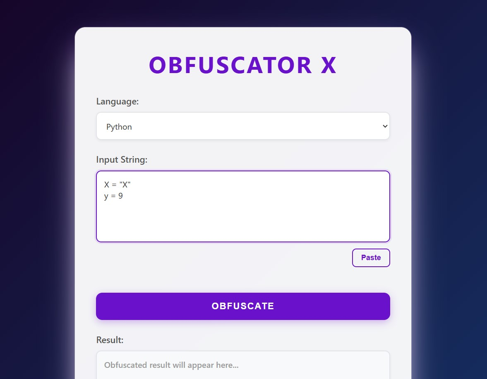

# Obfuscator-X v2
Obfuscator-X is a tool for encoding and obfuscating strings across different programming languages with a lightweight and modern design.

## Features

- **Multi-Language Support**: Encode strings for various programming languages including:
  - Python
  - Java
  - JavaScript
  - C
  - C#
  - Ruby
  - Go
  - Dart
  - C++

- **User-Friendly Interface**: Clean, modern design with gradient background and glass-morphism effects
- **Easy Clipboard Integration**: One-click paste and copy functionality
- **Responsive Design**
- **Non-Resizable Text Areas**

## Quick Start

1. **Select Programming Language**
2. **Input Your String**
3. **Obfuscate**
4. **Copy Result**

## License

This project is open source and available under the [MIT License](LICENSE).

## 👨‍💻 🎨

- GitHub: [Abodx9](https://github.com/Abodx9/)
- GitHub: [DangerousAngel](https://github.com/DangerousAngel/)
